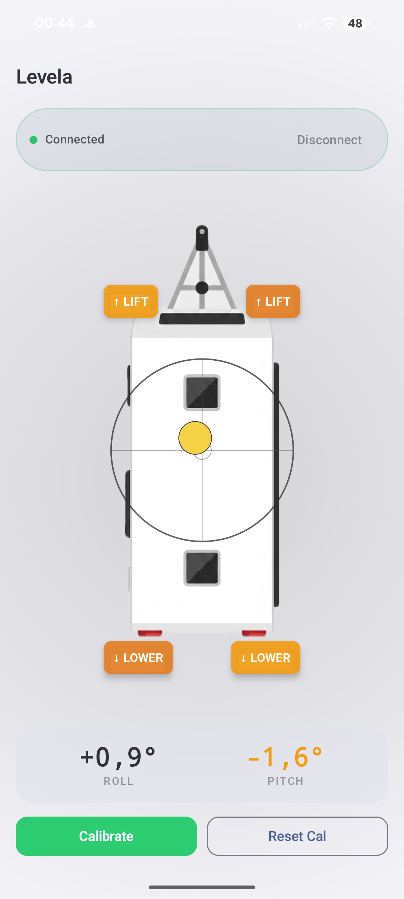

# Levela — Trailer Leveling System

A camping trailer leveling helper using an ESP32 and a GY-521 (MPU6050) accelerometer. The ESP32 streams live tilt data over Bluetooth Low Energy to an Android companion app that shows a bubble level, pitch/roll angles, and a top-view diagram of the trailer for correct mounting orientation.



## Features

- Live 20 Hz tilt data (pitch and roll) streamed over BLE
- 2D bubble level visualization — green when level, yellow when slightly off, red when far off
- Top-view trailer diagram showing correct ESP32 mounting orientation
- In-app calibration button — zeros the sensor on any flat reference surface
- Calibration stored in ESP32 flash (survives power cycles)
- Auto-reconnects to the ESP32 on Bluetooth drop

---

## Hardware

| Part | Notes |
|------|-------|
| ESP32 dev board | Any standard 38-pin ESP32 module |
| GY-521 (MPU6050) | I²C accelerometer/gyroscope breakout |
| Hookup wire | 4 wires needed |

### Wiring

```
GY-521 (MPU6050)     ESP32
─────────────────    ──────────
VCC              →   3V3
GND              →   GND
SDA              →   GPIO 21
SCL              →   GPIO 22
AD0              →   GND        (sets I²C address to 0x68)
INT              →   (not connected)
```

> **Note:** Do not connect VCC to 5V — the MPU6050 logic is 3.3V.

### Mounting on the trailer

Mount the ESP32 flat (horizontal) on the trailer frame, chassis, or A-frame, with:

- **X axis pointing toward the hitch** (front of trailer)
- **Y axis pointing toward trailer left**
- Board face pointing **up**

The Android app shows a top-view diagram illustrating this orientation.

---

## Firmware

Built with [PlatformIO](https://platformio.org/) + Arduino-ESP32 framework.

### Dependencies (auto-installed by PlatformIO)

- [`electroniccats/MPU6050`](https://github.com/electroniccats/mpu6050) — MPU6050 driver
- [`h2zero/NimBLE-Arduino`](https://github.com/h2zero/NimBLE-Arduino) — lightweight BLE stack

### Build & Flash

```bash
# Install PlatformIO CLI if needed
pip install platformio

cd firmware
pio run -t upload

# Monitor serial output
pio device monitor
```

Expected serial output on boot:
```
MPU6050 OK
Advertising as Levela-XXYY
```

### BLE Protocol

| Item | Value |
|------|-------|
| Device name | `Levela-XXYY` (last 2 bytes of MAC) |
| Service UUID | `6c65762d-0000-4000-8000-6c6576656c61` |
| Level Data characteristic | `6c65762d-0001-4000-8000-6c6576656c61` — notify, 8 bytes |
| Command characteristic | `6c65762d-0002-4000-8000-6c6576656c61` — write, 1 byte |

**Level Data payload** (8 bytes, little-endian):
```
bytes 0–3 : float32  roll  (degrees, positive = right side high)
bytes 4–7 : float32  pitch (degrees, positive = nose up)
```

**Command bytes:**
```
0x01 = calibrate now (capture current orientation as zero reference)
0x02 = clear calibration (reset to factory defaults)
```

---

## Android App

Built with Kotlin + Jetpack Compose. Minimum Android 8.0 (API 26).

### Build (no Android Studio required)

Requirements: JDK 17, Android SDK with platform 35 and build-tools 35+.

```bash
cd android
./gradlew assembleDebug
# APK: app/build/outputs/apk/debug/app-debug.apk
```

Install directly to a connected phone (USB debugging enabled):

```bash
./gradlew installDebug
```

Or sideload:

```bash
adb install app/build/outputs/apk/debug/app-debug.apk
```

### Permissions

- Android 12+ (API 31+): `BLUETOOTH_SCAN`, `BLUETOOTH_CONNECT`
- Android 8–11 (API 26–30): `ACCESS_FINE_LOCATION`

The app requests these at launch.

---

## Calibration

1. Park the trailer in the orientation you consider "level" (or use a physical bubble level as reference).
2. Open the app and connect to the ESP32.
3. Tap **Calibrate**. The ESP32 averages 50 readings, saves the offsets to flash, and from that point pitch and roll will read 0.0° in that position.
4. Tap **Reset Cal** to clear back to factory defaults.

Calibration data survives power cycles.

---

## Project Structure

```
levela/
├── firmware/
│   ├── platformio.ini
│   └── src/
│       └── main.cpp
└── android/
    ├── settings.gradle.kts
    ├── build.gradle.kts
    ├── gradle/
    │   └── libs.versions.toml
    └── app/
        └── src/main/
            ├── AndroidManifest.xml
            └── java/com/levela/app/
                ├── MainActivity.kt
                ├── ble/
                │   ├── BleManager.kt
                │   ├── BleState.kt
                │   └── BleUuids.kt
                └── ui/
                    ├── LevelScreen.kt
                    ├── LevelViewModel.kt
                    └── components/
                        ├── BubbleLevel.kt
                        ├── TrailerTopView.kt
                        ├── ConnectionBar.kt
                        └── AngleReadout.kt
```

---

## License

MIT
